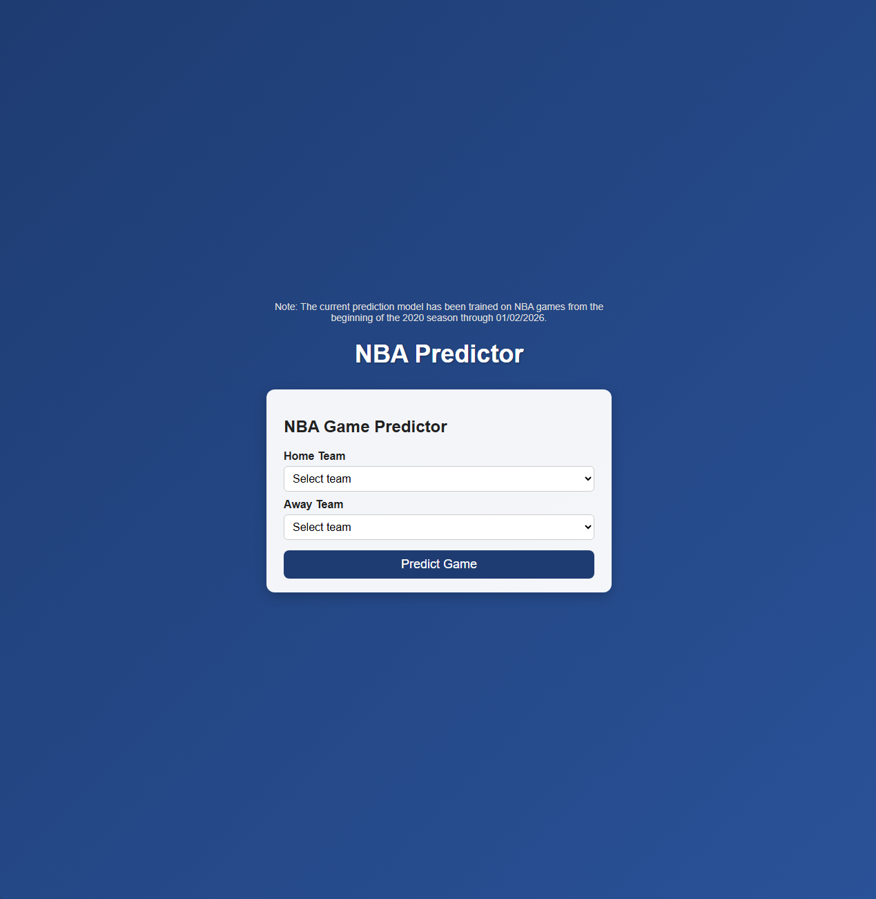
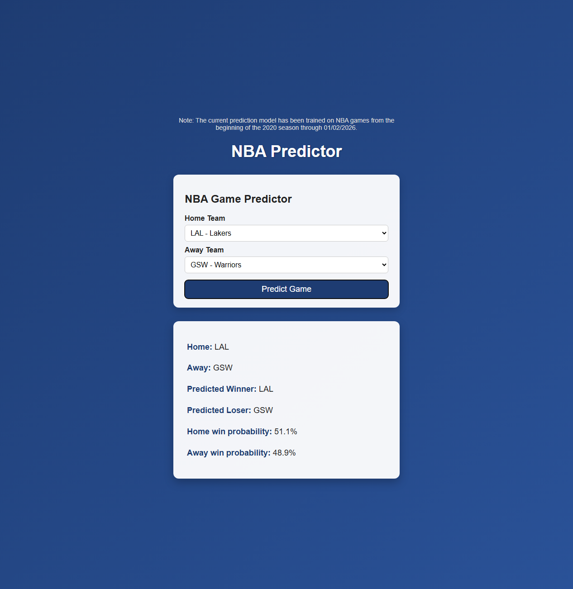

# NBA Game Predictor

This project predicts NBA game outcomes using historical game data and rolling team statistics. The prediction pipeline combines **RidgeClassifier** (for winner prediction) and **Logistic Regression** (for home win probability) in a weighted ensemble.

A **React frontend** communicates with a **Flask backend API**, which runs the ensemble prediction models.

---

## Project Structure

```
.
├── backend/
│   ├── app.py                    # Flask API for predictions
│   ├── ml/
│   │   ├── data/
│   │   │   └── rolling_df.csv    # Rolling features for model input
│   │   ├── predictor/
│   │   │   └── ensemble_predictor.py # Weighted ensemble prediction function
│   │   └── predict_game.py       # Wrapper function for API use
│   ├── scrape/                   # Optional, only for data updating
│   │   ├── fetch_nba_seasons.py
│   │   ├── read_nba_seasons.py
│   │   ├── parse_nba_data.py
│   │   ├── preprocess_nba_data.py
│   │   └── data/nba_games.csv
│
├── frontend/
│   ├── src/
│   │   ├── App.jsx               # Main React component
│   │   └── components/
│   │       └── TeamSelector.jsx  # Team selection component
│   └── package.json
```

---

## Data and Model Training Notes

* Models were trained on NBA games from the **start of the 2020 season through 01/02/2026**.
* All rolling statistics are computed from this dataset.
* Scraping scripts (`backend/scrape/`) are **optional** and provided only to show how the dataset was generated. You do **not need to run them** to use the models or API.

> ⚠️ Running the scraping scripts can take several hours to a full day depending on the season range.

> ⚠️ **Important:** If you want to predict a game using more recent results beyond 01/02/2026, you must:
>
> 1. Run `fetch_nba_seasons.py` in the `backend/scrape/` folder to download the latest season schedules.
> 2. Run `parse_nba_data.py` to extract box scores.
> 3. Run `read_nba_seasons.py`to construct `data\nba_games.csv`.
> 4. Retrain both models in the `train/` folder. This will recompute a new `rolling_df.csv` that the ensemble predictor uses.

---

## Backend API (Flask)

The Flask backend provides endpoints to get predictions:

### Endpoints

1. **GET `/`**
   Returns a simple message indicating the API is running:

```json
{
  "message": "NBA Predictor API is running"
}
```

2. **POST `/predict`**
   Returns the prediction for a single game.

**Request JSON:**

```json
{
  "home": "LAL",
  "away": "BOS"
}
```

**Response JSON:**

```json
{
  "home": "LAL",
  "away": "BOS",
  "predicted_winner": "BOS",
  "predicted_loser": "LAL",
  "home_win_prob": 45.3,
  "away_win_prob": 54.7
}
```

---

## Frontend (React)

The frontend provides a user interface to select **home** and **away** teams and display predictions.

**Features:**

* Team selection dropdown with abbreviations and names.
* Validation: prevents the same team from being selected for both home and away.
* Displays predicted winner, loser, and win probabilities.
* Shows a note: *“The current model has been trained on NBA games from the beginning of the 2020 season through 01/02/2026.”*

---

## Example App Screenshots

### Team Selection


*Dropdown menu to select home and away teams, with validation for same-team selection.*

### Prediction Result


*Shows predicted winner, loser, and win probabilities in a user-friendly layout.*

---

## Usage

### Run Flask Backend

```bash
# Activate virtual environment
.\venv\Scripts\activate  # Windows
source venv/bin/activate # macOS/Linux

# Install dependencies
pip install -r requirements.txt

# Start Flask API
python backend/app.py
```

### Run React Frontend

```bash
cd frontend
npm install
npm start
```

*Open `http://localhost:3000` in your browser to use the app.*

---

### Predict a Single Game in Python

You can also use the Python ensemble function directly:

```python
import pandas as pd
import joblib
from backend.ml.predictor.ensemble_predictor import predict_game_ensemble_weighted

rolling_df = pd.read_csv("backend/ml/data/rolling_df.csv")
ridge_model = joblib.load("backend/ml/models/ridge_classifier_final.pkl")
ridge_predictors = joblib.load("backend/ml/models/selected_predictors_ridge.pkl")
logistic_model = joblib.load("backend/ml/models/logistic_model_final.pkl")
logistic_predictors = joblib.load("backend/ml/models/selected_predictors_logistic.pkl")

result = predict_game_ensemble_weighted(
    rolling_df,
    ridge_model,
    ridge_predictors,
    logistic_model,
    logistic_predictors,
    home_team="LAL",
    away_team="BOS"
)

print(result)
```

---

## Notes

* Rolling features are computed over a **10-game window by default**.
* Predictions outside the 2020–2026 data range may be unreliable.
* Scraping scripts in `backend/scrape/` are **optional** and included only for reproducibility.
* Frontend styling is **responsive and interactive**, showing errors if the same team is selected for both home and away.