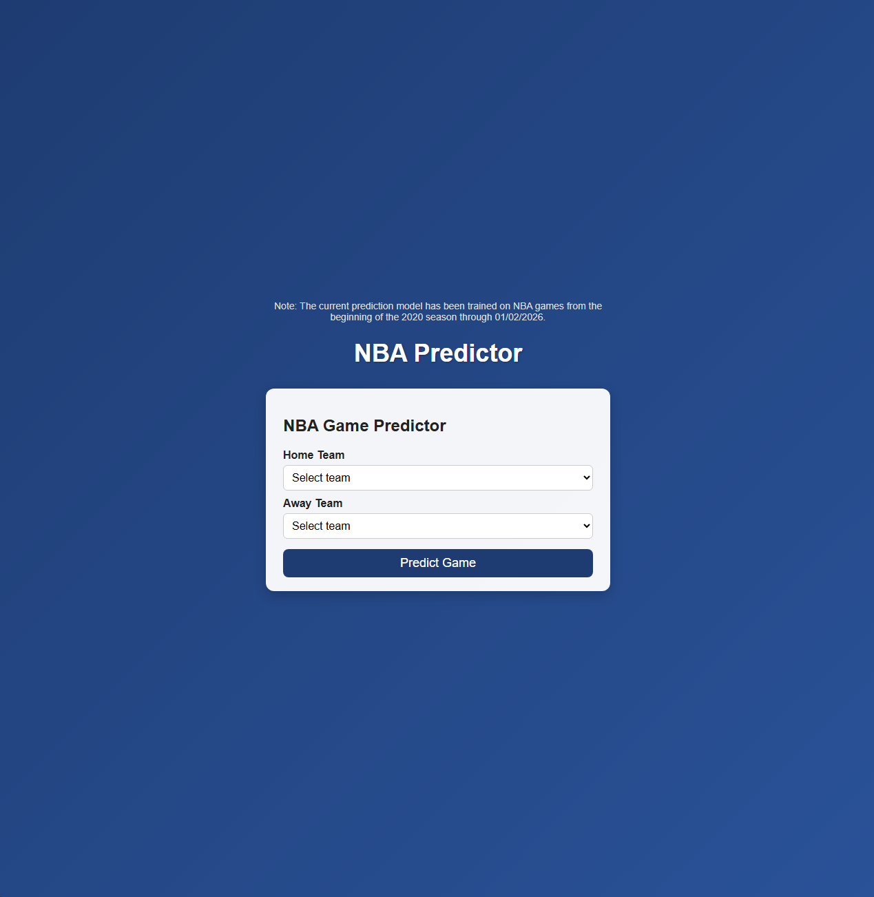
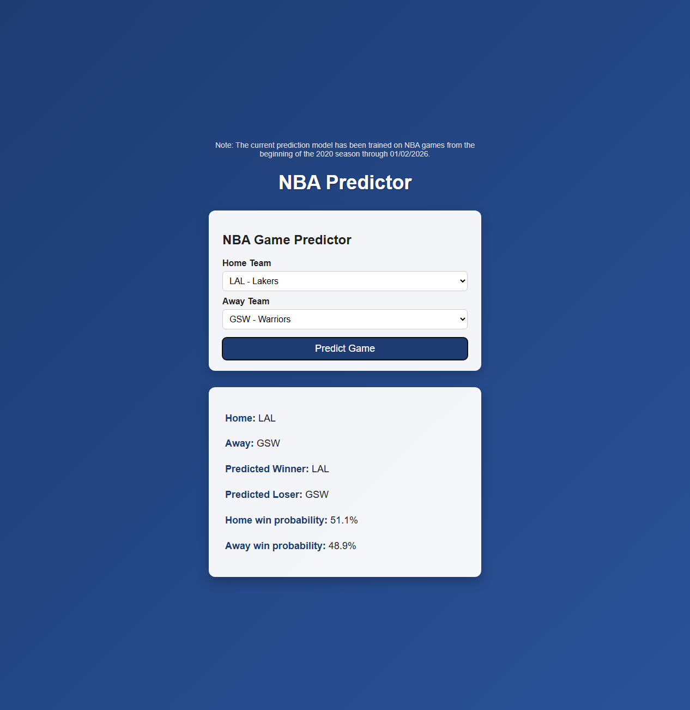

# NBA Game Predictor

This project predicts NBA game outcomes using historical game data and rolling team statistics. The machine learning models were trained on NBA games from 2020 through January 2, 2026 and evaluated using walk-forward season backtesting.

A **React frontend** communicates with a **Flask backend API**, which generates predictions using trained machine learning models. The frontend and backend are containerized separately with **Docker**, managed together with **Docker Compose**, and deployed to **Amazon EC2** using images stored in **Amazon ECR**.

---

## Technologies

- **Frontend:** React, Vite, JavaScript, HTML, CSS
- **Backend:** Python, Flask, Flask-CORS
- **Machine Learning:** pandas, scikit-learn, joblib
- **Containerization:** Docker, Docker Compose
- **Cloud:** AWS EC2, Amazon ECR, AWS IAM
- **Version Control:** Git, GitHub

---

## Model Performance

| Model | Walk-Forward Backtest Accuracy |
| --- | ---: |
| Logistic Regression | 62.85% |
| Ridge Classifier | 61.91% |

The Logistic Regression model achieved the strongest individual historical performance and serves as the primary benchmark for prediction quality.

---

## Features

- Select home and away NBA teams
- Prevent selection of the same team twice
- Predict the winner and loser
- Display home and away win probabilities
- Generate predictions through a Flask API
- Run locally with or without Docker
- Deploy the containerized application through AWS

---

## Project Structure

```text
.
├── backend/
│   ├── Dockerfile
│   ├── app.py
│   ├── ml/
│   │   ├── data/
│   │   │   └── rolling_df.csv
│   │   ├── models/
│   │   ├── predictor/
│   │   │   └── ensemble_predictor.py
│   │   └── predict_game.py
│   └── scrape/
│       ├── fetch_nba_seasons.py
│       ├── read_nba_seasons.py
│       ├── parse_nba_data.py
│       └── preprocess_nba_data.py
│
├── frontend/
│   ├── Dockerfile
│   ├── src/
│   │   ├── App.jsx
│   │   └── components/
│   │       └── TeamSelector.jsx
│   ├── package.json
│   └── vite.config.js
│
├── screenshots/
│   ├── team_selection.png
│   └── prediction_result.png
│
├── compose.yaml
├── .env.example
├── requirements.txt
└── README.md
```

---

## Data and Training Notes

- Models were trained using NBA games from the beginning of the 2020 season through January 2, 2026.
- Rolling team statistics are calculated using a 10-game window.
- Walk-forward validation was used to simulate real-world prediction conditions.
- The scraping scripts are included to show how the historical dataset was collected.
- The scraping pipeline is not required to run the application.

> Running the complete scraping pipeline may take several hours depending on the number of seasons being downloaded.

To make predictions using newer data, the dataset, rolling features, and trained models must be updated.

---

## Backend API

### GET `/`

Checks whether the API is running.

#### Response

```json
{
  "message": "NBA Predictor API is running"
}
```

### POST `/predict`

Generates a prediction for one NBA game.

#### Request

```json
{
  "home": "LAL",
  "away": "BOS"
}
```

#### Response

```json
{
  "home": "LAL",
  "away": "BOS",
  "predicted_winner": "BOS",
  "predicted_loser": "LAL",
  "home_win_prob": 45.3,
  "away_win_prob": 54.7
}
```

---

## Screenshots

### Team Selection



### Prediction Result



---

## Running with Docker Compose

### Prerequisites

- Docker
- Docker Compose

Create a `.env` file in the root directory:

```env
AWS_ACCOUNT_ID=your_12_digit_aws_account_id
```

The AWS account ID is used to construct the ECR image names in `compose.yaml`. It is not an AWS access key or secret key.

Start the frontend and backend:

```bash
docker compose up --build
```

Open the frontend:

```text
http://localhost:3000
```

The backend API is available at:

```text
http://localhost:5000
```

Stop the application:

```bash
docker compose down
```

After the images have already been built, the application can be started with:

```bash
docker compose up
```

---

## Running Without Docker

### Start the Flask Backend

Create a virtual environment:

```bash
python -m venv venv
```

Activate it on Windows:

```bash
.\venv\Scripts\activate
```

Activate it on macOS or Linux:

```bash
source venv/bin/activate
```

Install the Python dependencies:

```bash
pip install -r requirements.txt
```

Start the backend:

```bash
python backend/app.py
```

The API will run at:

```text
http://localhost:5000
```

### Start the React Frontend

Open another terminal:

```bash
cd frontend
npm install
npm run dev
```

Open:

```text
http://localhost:3000
```

---

## AWS Deployment

The application was deployed using:

- **Amazon ECR** to store the frontend and backend Docker images
- **Amazon EC2** to run the application
- **AWS IAM** to allow EC2 to access the private ECR repositories
- **Docker Compose** to run and manage both containers

### Deployment Workflow

```text
Build images locally
        ↓
Push images to Amazon ECR
        ↓
Pull images onto Amazon EC2
        ↓
Run with Docker Compose
```

Two private ECR repositories are used:

```text
nba-client
nba-server
```

Build and push the images locally:

```bash
docker compose build
docker compose push
```

On the EC2 instance, pull and run the images:

```bash
docker compose pull
docker compose up -d --no-build
```

The deployed application is available at:

```text
http://EC2_PUBLIC_IP:3000
```

The backend API is available at:

```text
http://EC2_PUBLIC_IP:5000
```

The frontend determines the backend hostname dynamically, allowing the same frontend code to work locally and on EC2.

---

## Updating the Deployment

After changing the application, rebuild and push the updated images:

```bash
docker compose build
docker compose push
```

Then update the EC2 deployment:

```bash
docker compose pull
docker compose up -d --no-build
```

To update only one service:

```bash
docker compose build frontend
docker compose push frontend
```

or:

```bash
docker compose build backend
docker compose push backend
```

---

## Machine Learning Pipeline

### Data Preparation

- Load and clean historical NBA game data
- Generate rolling team statistics
- Create matchup-level features
- Align rolling statistics to prevent future data leakage

### Model Training

- Logistic Regression estimates home-team win probability
- Ridge Classifier predicts the game winner
- Sequential Feature Selection identifies useful model features
- Models are evaluated using walk-forward season backtesting

### Evaluation

- Logistic Regression achieved **62.85% backtest accuracy**
- Ridge Classifier achieved **61.91% backtest accuracy**
- Walk-forward validation was used to approximate real-world forecasting performance

---

## Notes

- Predictions are based on historical performance and are not guaranteed.
- Predictions using teams or data outside the training period may be less reliable.
- The frontend runs on port `3000`.
- The backend runs on port `5000`.
- GitHub stores the source code.
- Amazon ECR stores the built Docker images.
- Amazon EC2 pulls and runs the images using Docker Compose.
- AWS credentials should never be committed to the repository.
